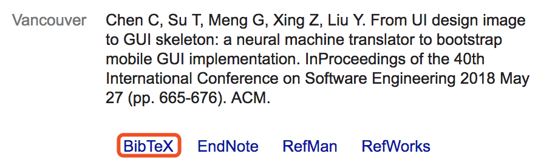

# The guide of paper writing in Latex

This document record my experience in wirting paper with Latex. So if you'd like to collaborate with me in writing some research papers, please have a look at this guide.

## Overall:
- Use the latex template downloaded from the official sites of the conference or journal.
- Please write each sentence in one row so that readers (actually I) can easily understand.
- Please separate each section as a file, and add them into the main file.
- For each section, figure, table, please attach a label to it with the command `\label{}`. Please name it with semantically e.g., `\label{sec:introduction}`, `\label{fig:comparisonResult}`, `\label{tab:goodExample}`. When referring the `figure/table/section` in the main text, please use `\ref` command e.g., `Fig. \ref{fig: comparisonResult}`
- If multiple users are working on the latex, please make everyone write text in different colors. You can define a macro in the main file like \newcommand{\chunyang}[1]{\textcolor{blue}{\textbf{Chunyang}:#1}}. 
- Please put all your references into a file (e.g., called `refercen.bib`), and import it using the latex command. Note that all bibtex can be copied-pasted from Google Scholar.

## Figures
- When showing results in the figure, please make the font size of the axis labels large enough so that reader can understand it.
- Please store your figure in pdf format as pdf figure is vector figure. It will not collapse when zooming in.
- Please put all figure files into one folder and refer to it in the latex with relative path, e.g., `\includegraphics[width=1.0\textwidth]{figures/autoencoder.pdf}`
- When using the table to show example, especially with many rows, please using white-gray 

## Table
- When using the table to show example, especially with many rows, please color alternative rows in [white and gray](https://tex.stackexchange.com/questions/5365). 
- When we want to save space, you can use `\vspace{-2mm}` between the caption and the table, or between the caption and the main text.

## Contact
I will keep maintaining this guideline list, please feel free to clone or submit new suggestions to it. If you have further questions, please create an issue or drop me an email wchccy@gmail.com.
